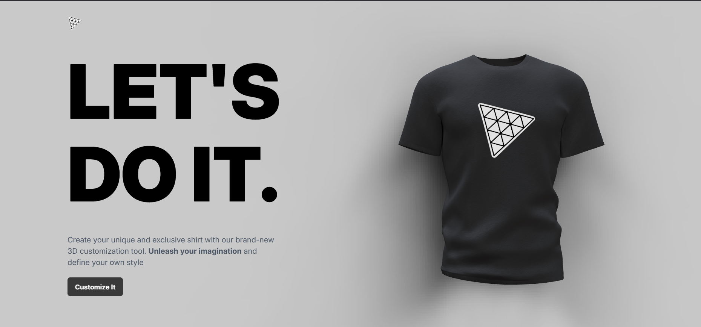
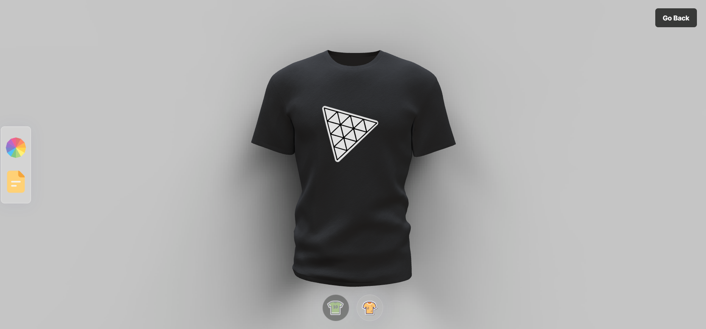

# ThreeJs-Tshirt


<p align="center">
    
</p>

<p align="center">
    <a href="#about">About |</a> 
    <a href="#started">Getting Started</a> 
    <a href="#routes">| App Routes</a>
    <a href="#images">| Images</a> 
</p>

<h2 id="about">📌 About</h2>

 Create custom shirts with an interactive system that allows you to choose dynamic colors and upload logos or full prints. See real-time previews and ensure a unique and exclusive design.

<h2 id="started">🚀 Getting started</h2>

<h3>Cloning</h3>

```bash
git clone https://github.com/RafaelHDSV/ThreeJs-Tshirt.git
yarn install
```

<h3>Starting</h3>

```bash
cd ThreeJs-Tshirt
yarn start
```

<h2 id="images">📷 Images</h2>

<h3>Home page</h3>


<h3>Customizer page</h3>
